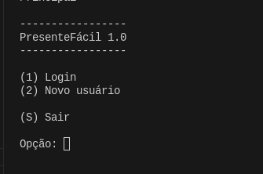
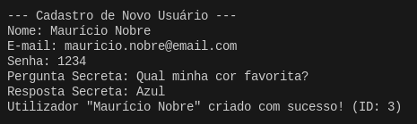
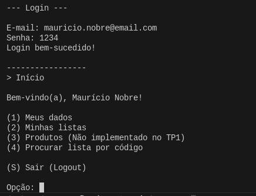
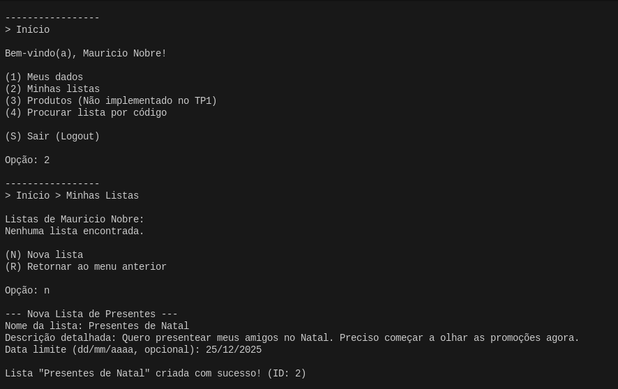
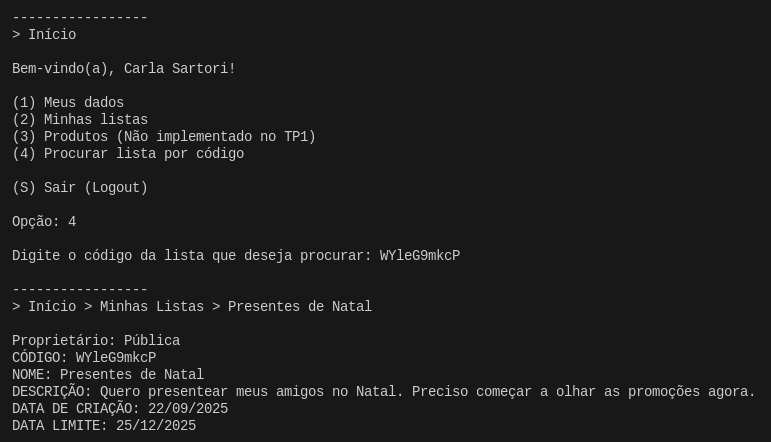
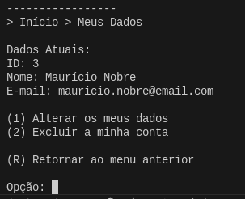

## 🎁 PresenteFácil 1.0 🎁

_Algoritimos e Estrutura de Dados III — Trabalho Prático 01_

---

### 📝 Descrição do Projeto

O **PresenteFácil**  é um sistema de linha de comando desenvolvido para simplificar a vida de quem quer centralizar seus desejos e compartilhá-los com amigos e familiares de uma maneira organizada. A aplicação permite que usuários se cadastem, criem múltiplas listas para diferentes ocasiões (como aniversários e casamentos) e as compartilhem com amigos e familiares através de um código único, facilitando a troca de presentes e evitando duplicatas.

O projeto foi construído em Java, utilizando um sistema de persistência de dados baseado em ficheiros de acesso direto. A eficiência das buscas e dos relacionamentos é garantida pela implementação de estruturas de dados avançadas, como Tabela Hash e Árvore B+, que atuam como índices secundários para as entidades Usuario e Lista.

---

### 🧑‍💻 Equipe do Projeto

* Ana Clara Lonczynski
* Bruno Menezes Rodrigues Oliveira Vaz
* João Costa Calazans
* Letícia Azevedo Cota Barbosa 
* Miguel Pessoa Lima Ferreira

---
### 🎥 Vídeo de Demonstração:

[VideoTP1](https://www.youtube.com)

---

### 🚀 Funcionalidades Principais

* **Autenticação e Gestão de Usuários**: O sistema possui um fluxo completo de autenticação, permitindo o cadastro de novos utilizadores e o login via e-mail e senha (armazenada em formato de hash para segurança). O acesso é feito via e-mail e senha. O utilizador autenticado pode visualizar, alterar ou excluir os seus próprios dados, além de poder recuperar sua senha por meio de pergunta e resposta secretas.

* **Criação de Listas de Presentes**: Um usuário pode criar múltiplas listas, cada uma com um nome, descrição e, opcionalmente, uma data limite. Cada lista é vinculada a um único usuário.

* **CRUD Completo de Listas**: Um utilizador autenticado pode criar, ler, atualizar e excluir múltiplas listas de presentes. Cada lista é vinculada unicamente ao seu criador, estabelecendo um relacionamento 1-N. A navegação é intuitiva, utilizando menus textuais e um "rastro" (breadcrumb) para indicar a localização do usuário no sistema.
  
* **Visualização e Compartilhamento**: Para cada lista criada, o sistema gera automaticamente um código compartilhável único, alfanumérico de 10 caracteres (semelhante ao NanoID). Esse código permite que o criador da lista a compartilhe com outras pessoas, que poderão visualizar o conteúdo.
  
* **Interface de Linha de Comando Intuitiva**: A navegação é realizada através de menus textuais simples. O sistema utiliza um "breadcrumb" (ex: > Início > Minhas Listas) para que o utilizador saiba sempre a sua localização na aplicação.

---

### 📸 Principais Telas

Abaixo estão as principais telas do sistema.

* Tela de Login de Usuário:

* Tela de Cadastro de Usuário:

* Menu Principal:

* Tela de criação de Lista:

 

* Exibição de Listas do Usuário:

* Tela de Compartilhamento por NanoID:

* Tela de Exibição dos Dados do Usuário:

 

---
### ⚙️ Arquitetura e Principais Classes 

O sistema foi desenvolvido seguindo o padrão MVC (Model-View-Controller) para separar as responsabilidades de dados, interface e lógica de controlo, por meio de diversas classes, as principais são:

* ***Usuario***: A classe representa os dados da entidade "Usuário" no sistema. Ela cria o usuario, aplica HashExtensivel na senha e implementa a a interface 'Entidade' para ser compatível com o sistema de arquivos genérico.
  
* ***CRUDUsuario***: A classe CRUDUsuario estende a classe genérica Arquivo e gere todas as operações de persistência para a entidade Usuário. Ela mantém um índice secundário por e-mail (Hash Extensível) para acelerar as buscas e o processo de login.
  
* ***Lista***: A classe representa a entidade "Lista de Presentes" no sistema. Ela implementa a interface 'Entidade' para ser compatível com o sistema de arquivos genérico e 'Comparable' para permitir a ordenação alfabética das listas pelo nome.

* ***CRUDLista***: A classe CRUDLista estende a classe genérica Arquivo e gere todas as operações de persistência para a entidade Lista. Ela mantém um índice secundário por código (Hash Extensível) para buscas públicas e um índice de relacionamento (Árvore B+) para ligar utilizadores às suas listas.

* ***ControleLista***: A classe é responsável por gerir toda a lógica de negócio relacionada às listas, atuando como o intermediário entre as classes de modelo (dados) e as classes de visão (interface com o utilizador).
  
* ***ControlePrincipal***: A classe é o ponto de entrada da aplicação. Ela é responsável por orquestrar o fluxo principal do sistema, gerindo o login, a criação de utilizadores e o acesso aos menus de funcionalidades após a autenticação.
  
* ***ControleUsuario***: A classe 'ControleUsuario' é responsável por gerenciar toda a lógica de negócio relacionada aos usuários, como autenticação, cadastro e gerenciamento de perfil. Ela atua como um mediador entre as classes de persistência (CRUD) e a interface com o usuário (VisaoUsuario).
  
* ***Arquivo***: A classe genérica 'Arquivo' é responsável por implementar o CRUD de base com reutilização de espaço (lista de espaços livres).
  
* ***ArvoreBMais***: A classe 'ArvoreBMais' é responsável por implementar uma árvore B+ para índice indireto que gere o relacionamento 1-N entre utilizadores e listas.
  
* ***HashExtensivel***: A classe 'HashExtensivel' é responsável por implementar uma tabela HashExtensivel, usada para os índices de acesso direto (e-mail do utilizador e código da lista).
  
---

### ✅ Checklist

|Requisito|Status|
|---------|------|
|Há um CRUD de usuários (que estende a classe ArquivoIndexado, acrescentando Tabelas Hash Extensíveis e Árvores B+ como índices diretos e indiretos conforme necessidade) que funciona corretamente?|[✅]|
|Há um CRUD de listas (que estende a classe ArquivoIndexado, acrescentando Tabelas Hash Extensíveis e Árvores B+ como índices diretos e indiretos conforme necessidade) que funciona corretamente?|[✅]|
|As listas de presentes estão vinculadas aos usuários usando o idUsuario como chave estrangeira?|[✅]|
|Há uma árvore B+ que registre o relacionamento 1:N entre usuários e listas?|[✅]|
|Há um CRUD de usuários (que estende a classe ArquivoIndexado, acrescentando Tabelas Hash Extensíveis e Árvores B+ como índices diretos e indiretos conforme necessidade)?|[✅]|
|Há uma visualização das listas de outras pessoas por meio de um código NanoID?|[✅]|
|O trabalho compila corretamente?|[✅]|
|O trabalho está completo e funcionando sem erros de execução?|[✅]|
|O trabalho é original e não a cópia de um trabalho de outro grupo?|[✅]|

